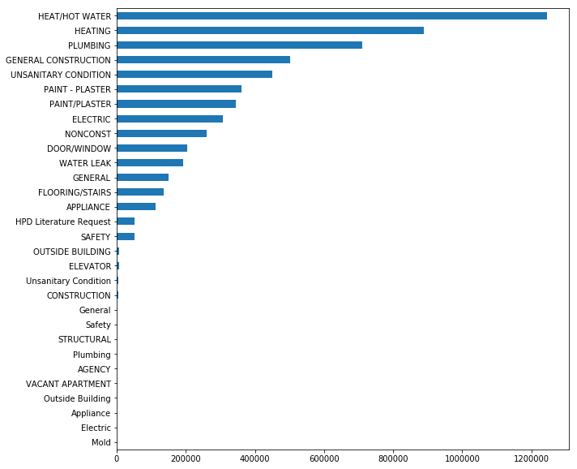
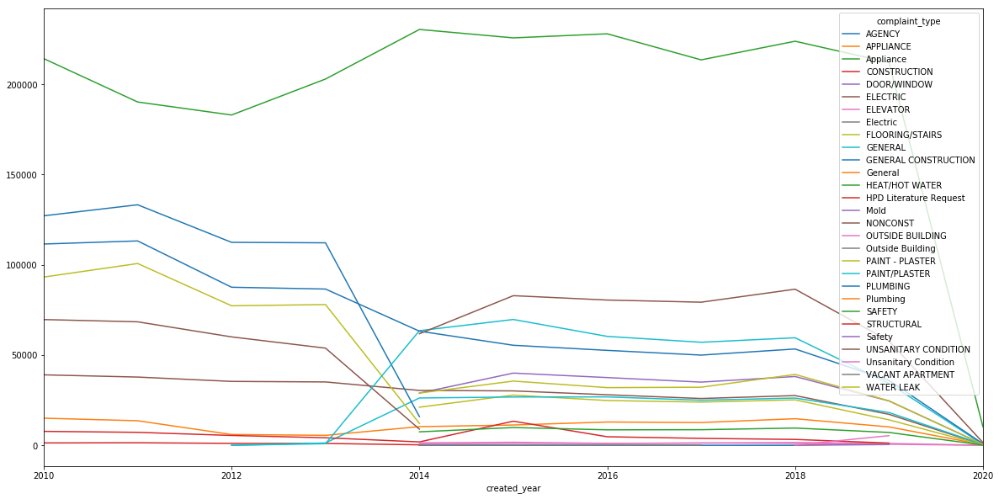

# Notebook 1 -- What Is the Top Complaint Type?

Problem Statement:  Which type of complaint should the Department of Housing Preservation and Development of New York City focus on first?


```python
import numpy as np 
import pandas as pd
import matplotlib.pyplot as plt
```


```python
#Behind the scenese ingestion
#filename = 'https://data.cityofnewyork.us/resource/fhrw-4uyv.csv?$limit=10000000&Agency=HPD&$select=created_date,unique_key,complaint_type,incident_zip,incident_address,street_name,address_type,city,resolution_description,borough,latitude,longitude,closed_date,location_type,status'
#NYC311dataset = pd.read_csv(filename, parse_dates=True)
```


```python
## @hidden_cell
## The following code contains the credentials for a file in your IBM Cloud Object Storage.
## You might want to remove those credentials before you share your notebook.
#credentials_1 = {
#    'IAM_SERVICE_ID': 'iam-ServiceId-e9adcd98-2791-488b-bc78-7317576edd3b',
#    'IBM_API_KEY_ID': 'fvXbEQcvPtlN9f6GBjDpVTVNbNQDfg8yvu3uK7J6GYJ_',
#    'ENDPOINT': 'https://s3-api.us-geo.objectstorage.service.networklayer.com',
#    'IBM_AUTH_ENDPOINT': 'https://iam.ng.bluemix.net/oidc/token',
#    'BUCKET': 'capstone-donotdelete-pr-apq0yi5eis4rme',
#    'FILE': 'NYC311_HPD.csv'
#}
```


```python
#Cut and paste stuff required for IBM Watson stuff
import types
from botocore.client import Config
import ibm_boto3

def __iter__(self): return 0

# @hidden_cell
# The following code accesses a file in your IBM Cloud Object Storage. It includes your credentials.
# You might want to remove those credentials before you share the notebook.
client_76c0c2a6a77b45f2b066bcea0f39e9c7 = ibm_boto3.client(service_name='s3',
    ibm_api_key_id='fvXbEQcvPtlN9f6GBjDpVTVNbNQDfg8yvu3uK7J6GYJ_',
    ibm_auth_endpoint="https://iam.ng.bluemix.net/oidc/token",
    config=Config(signature_version='oauth'),
    endpoint_url='https://s3-api.us-geo.objectstorage.service.networklayer.com')

#body = client_76c0c2a6a77b45f2b066bcea0f39e9c7.get_object(Bucket='capstone-donotdelete-pr-apq0yi5eis4rme',Key='NYC311_HPD.csv')['Body']
## add missing __iter__ method, so pandas accepts body as file-like object
#if not hasattr(body, "__iter__"): body.__iter__ = types.MethodType( __iter__, body )
##df_data_1 = pd.read_csv(body)
##df_data_1.head()

client_cred = ibm_boto3.client(service_name='s3',
ibm_api_key_id='fvXbEQcvPtlN9f6GBjDpVTVNbNQDfg8yvu3uK7J6GYJ_',
ibm_auth_endpoint='https://iam.ng.bluemix.net/oidc/token',
config=Config(signature_version='oauth'),
endpoint_url='https://s3-api.us-geo.objectstorage.service.networklayer.com')

bucket = 'capstone-donotdelete-pr-apq0yi5eis4rme'

```


```python
#Behind the scenese ingestion
##Export to csv
#NYC311dataset.to_csv('NYC311_HPD.csv')
```


```python
#Behind the scenese ingestion
#NYC311dataset.head()
```


```python
#Behind the scenese ingestion
#NYC311dataset.to_pickle('./df_raw.pkl')
```


```python
#Behind the scenese ingestion
#bucket = 'capstone-donotdelete-pr-apq0yi5eis4rme'
#client_cred.upload_file('./df_raw.pkl',bucket,'df_raw_cos.pkl')
```

# Take in data from ingestion of website now stored as a pickle


```python
client_cred.download_file(Bucket=bucket,Key='df_raw_cos.pkl',Filename='./df_raw_local.pkl')
```


```python
#Make datafram from pickle
df = pd.read_pickle('./df_raw_local.pkl')
```


```python
df.shape
```


    (5998523, 15)


```python
#QC pickle as Pandas dataframe to make sure nothing went awry
df.head()
```


<div>
<style scoped>
    .dataframe tbody tr th:only-of-type {
        vertical-align: middle;
    }

    .dataframe tbody tr th {
        vertical-align: top;
    }

    .dataframe thead th {
        text-align: right;
    }
</style>
<table border="1" class="dataframe">
  <thead>
    <tr style="text-align: right;">
      <th></th>
      <th>created_date</th>
      <th>unique_key</th>
      <th>complaint_type</th>
      <th>incident_zip</th>
      <th>incident_address</th>
      <th>street_name</th>
      <th>address_type</th>
      <th>city</th>
      <th>resolution_description</th>
      <th>borough</th>
      <th>latitude</th>
      <th>longitude</th>
      <th>closed_date</th>
      <th>location_type</th>
      <th>status</th>
    </tr>
  </thead>
  <tbody>
    <tr>
      <th>0</th>
      <td>2020-01-15T21:20:00.000</td>
      <td>45397440</td>
      <td>HEAT/HOT WATER</td>
      <td>10456.0</td>
      <td>1250 FRANKLIN AVENUE</td>
      <td>FRANKLIN AVENUE</td>
      <td>ADDRESS</td>
      <td>BRONX</td>
      <td>The following complaint conditions are still o...</td>
      <td>BRONX</td>
      <td>40.830871</td>
      <td>-73.902850</td>
      <td>NaN</td>
      <td>RESIDENTIAL BUILDING</td>
      <td>Open</td>
    </tr>
    <tr>
      <th>1</th>
      <td>2020-01-15T10:54:04.000</td>
      <td>45396490</td>
      <td>GENERAL</td>
      <td>10039.0</td>
      <td>208 WEST  151 STREET</td>
      <td>WEST  151 STREET</td>
      <td>ADDRESS</td>
      <td>NEW YORK</td>
      <td>The following complaint conditions are still o...</td>
      <td>MANHATTAN</td>
      <td>40.825551</td>
      <td>-73.936620</td>
      <td>NaN</td>
      <td>RESIDENTIAL BUILDING</td>
      <td>Open</td>
    </tr>
    <tr>
      <th>2</th>
      <td>2020-01-15T19:45:27.000</td>
      <td>45397525</td>
      <td>HEAT/HOT WATER</td>
      <td>10039.0</td>
      <td>247 WEST  145 STREET</td>
      <td>WEST  145 STREET</td>
      <td>ADDRESS</td>
      <td>NEW YORK</td>
      <td>The complaint you filed is a duplicate of a co...</td>
      <td>MANHATTAN</td>
      <td>40.822237</td>
      <td>-73.940471</td>
      <td>NaN</td>
      <td>RESIDENTIAL BUILDING</td>
      <td>Open</td>
    </tr>
    <tr>
      <th>3</th>
      <td>2020-01-15T14:51:01.000</td>
      <td>45396824</td>
      <td>UNSANITARY CONDITION</td>
      <td>11230.0</td>
      <td>1430 OCEAN AVENUE</td>
      <td>OCEAN AVENUE</td>
      <td>ADDRESS</td>
      <td>BROOKLYN</td>
      <td>The following complaint conditions are still o...</td>
      <td>BROOKLYN</td>
      <td>40.627188</td>
      <td>-73.956683</td>
      <td>NaN</td>
      <td>RESIDENTIAL BUILDING</td>
      <td>Open</td>
    </tr>
    <tr>
      <th>4</th>
      <td>2020-01-15T21:36:50.000</td>
      <td>45399384</td>
      <td>HEAT/HOT WATER</td>
      <td>10467.0</td>
      <td>3345 DECATUR AVENUE</td>
      <td>DECATUR AVENUE</td>
      <td>ADDRESS</td>
      <td>BRONX</td>
      <td>The following complaint conditions are still o...</td>
      <td>BRONX</td>
      <td>40.877557</td>
      <td>-73.872945</td>
      <td>NaN</td>
      <td>RESIDENTIAL BUILDING</td>
      <td>Open</td>
    </tr>
  </tbody>
</table>
</div>


# Section Goal:
    What Is the Top Complaint Type? 
Project Statement:
    Which type of complaint should the Department of Housing Preservation and Development of New York City focus on first?


```python
df.info()
```

    <class 'pandas.core.frame.DataFrame'>
    RangeIndex: 5998523 entries, 0 to 5998522
    Data columns (total 15 columns):
    created_date              object
    unique_key                int64
    complaint_type            object
    incident_zip              float64
    incident_address          object
    street_name               object
    address_type              object
    city                      object
    resolution_description    object
    borough                   object
    latitude                  float64
    longitude                 float64
    closed_date               object
    location_type             object
    status                    object
    dtypes: float64(3), int64(1), object(11)
    memory usage: 686.5+ MB


```python
#Show unique complaint types
df['complaint_type'].unique()
```


    array(['HEAT/HOT WATER', 'GENERAL', 'UNSANITARY CONDITION', 'PLUMBING',
           'APPLIANCE', 'WATER LEAK', 'PAINT/PLASTER', 'DOOR/WINDOW',
           'ELECTRIC', 'FLOORING/STAIRS', 'SAFETY', 'ELEVATOR',
           'OUTSIDE BUILDING', 'Unsanitary Condition',
           'HPD Literature Request', 'HEATING', 'PAINT - PLASTER', 'Safety',
           'Electric', 'NONCONST', 'CONSTRUCTION', 'GENERAL CONSTRUCTION',
           'General', 'AGENCY', 'STRUCTURAL', 'VACANT APARTMENT',
           'Outside Building', 'Plumbing', 'Appliance', 'Mold'], dtype=object)


```python
#Count occurrences of complaint types
df['complaint_type'].value_counts()
```


    HEAT/HOT WATER            1246090
    HEATING                    887869
    PLUMBING                   710182
    GENERAL CONSTRUCTION       500863
    UNSANITARY CONDITION       450187
    PAINT - PLASTER            361257
    PAINT/PLASTER              345866
    ELECTRIC                   306871
    NONCONST                   260890
    DOOR/WINDOW                204666
    WATER LEAK                 193057
    GENERAL                    150840
    FLOORING/STAIRS            137182
    APPLIANCE                  112467
    HPD Literature Request      52830
    SAFETY                      51362
    OUTSIDE BUILDING             7124
    ELEVATOR                     6700
    Unsanitary Condition         5499
    CONSTRUCTION                 5078
    General                      1163
    Safety                        424
    STRUCTURAL                     16
    Plumbing                       11
    AGENCY                          9
    VACANT APARTMENT                8
    Outside Building                6
    Appliance                       4
    Electric                        1
    Mold                            1
    Name: complaint_type, dtype: int64


```python
#Make visual
df['complaint_type'].value_counts().sort_values(ascending=True).plot(kind='barh', figsize=(10, 10))
plt.show()
```


    

    


# To answer the question, the authors group Heat/Hot Water with Heating, so let's merge these complaints.


```python
#Merging of very similar types
df['complaint_type'] = np.where(df['complaint_type']=='HEATING','HEAT/HOT WATER',df['complaint_type'])
```


```python
#New Counts!
df['complaint_type'].value_counts()
```


    HEAT/HOT WATER            2133959
    PLUMBING                   710182
    GENERAL CONSTRUCTION       500863
    UNSANITARY CONDITION       450187
    PAINT - PLASTER            361257
    PAINT/PLASTER              345866
    ELECTRIC                   306871
    NONCONST                   260890
    DOOR/WINDOW                204666
    WATER LEAK                 193057
    GENERAL                    150840
    FLOORING/STAIRS            137182
    APPLIANCE                  112467
    HPD Literature Request      52830
    SAFETY                      51362
    OUTSIDE BUILDING             7124
    ELEVATOR                     6700
    Unsanitary Condition         5499
    CONSTRUCTION                 5078
    General                      1163
    Safety                        424
    STRUCTURAL                     16
    Plumbing                       11
    AGENCY                          9
    VACANT APARTMENT                8
    Outside Building                6
    Appliance                       4
    Electric                        1
    Mold                            1
    Name: complaint_type, dtype: int64


```python
#Rerun visual graphics
df['complaint_type'].value_counts().sort_values(ascending=True).plot(kind='barh', figsize=(10, 10))
plt.show()
```


    

    


```python
#Want to know why that was required?
from datetime import datetime
df['created_date'] = pd.to_datetime(df['created_date'], format = '%Y%m%dT%H:%M:%S.%f')
df.info()
```

    <class 'pandas.core.frame.DataFrame'>
    RangeIndex: 5998523 entries, 0 to 5998522
    Data columns (total 15 columns):
    created_date              datetime64[ns]
    unique_key                int64
    complaint_type            object
    incident_zip              float64
    incident_address          object
    street_name               object
    address_type              object
    city                      object
    resolution_description    object
    borough                   object
    latitude                  float64
    longitude                 float64
    closed_date               object
    location_type             object
    status                    object
    dtypes: datetime64[ns](1), float64(3), int64(1), object(10)
    memory usage: 686.5+ MB


```python
df['created_year'] = df['created_date'].map(lambda x: x.strftime('%Y')).astype(int)
```


```python
#Time series data usually shows when 'something chnaged'
fig, ax = plt.subplots(figsize=(20,10))
df.groupby(['created_year', 'complaint_type']).count()['unique_key'].unstack().plot(ax=ax)
```


    <matplotlib.axes._subplots.AxesSubplot at 0x7fadb3962cc0>


    

    


# So, we see in 2014, there was a recategorization on the data and there was a change when I started this project in the new year.

# In conclusion: 
    What Is the Top Complaint Type?
    Which type of complaint should the Department of Housing Preservation and Development of New York City focus on first?
    
This notebook provides the answer to this question and the Heat/Hot Water is the top complaint received from New York residents.


```python

```
