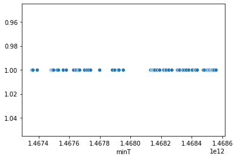
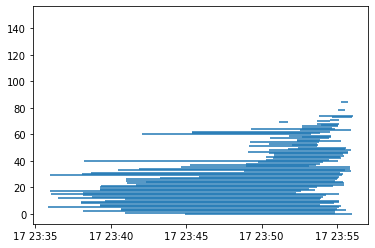
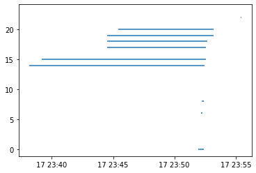
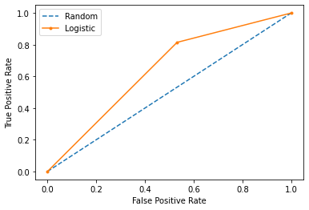

# SherLock

## Load Libraries


```python
import pandas as pd
import matplotlib.pylab as plt
import seaborn as sns
import numpy as np
import datetime
from sklearn.model_selection import train_test_split
from sklearn.pipeline import Pipeline
from sklearn.preprocessing import StandardScaler
from sklearn.linear_model import LogisticRegression
from sklearn.metrics import roc_curve
from sklearn.metrics import roc_auc_score
from matplotlib import pyplot
import pickle
```


```python
pd.set_option('display.max_columns', None)
```

2016_Q3

Time begin
Friday, 
2016 07 01 00:00:00
1467352800000

Time end
Friday, July 15
2016 07 15 00:00:00
1468562400000

'''awk '{ if ($2 > 1467352800000 && $2 < 1468562400000) print $0 }' sherlock-2016_Q3-allbroadcastprobe-000000_0 > F2wks_sherlock-2016_Q3-allbroadcastprobe-000000_0.tsv'''

This notebook was intended to be the 'exploratory' notebook and was to cycle through all the data in what was hoped to be the 'official' data from the 2016-Q3 files.

### Functions Used


```python
# Functions
#def editTextFile(f):
#    # Read in the file
#    with open(f, 'r') as file:
#        filedata = file.read()
#
#    # Replace the target string
#    filedata = filedata.replace('[msec],size','[msec];size')
#
#    # Write the file out again
#    with open('editTextFile.txt', 'w') as file:
#        file.write(filedata)
#        
#def magVector(df,col1,col2,col3):
#    # Calculate magnitude of vector - SQRT(X^2 + Y^2 + Z^2)
#    return ((df[col1].pow(2) + df[col2].pow(2) + df[col3].pow(2)).pow(1/2))        
```

## Load Data

### PUSH Sensor Table


```python
#filename = '/Users/kent/Downloads/F2wks_sherlock-2016_Q3-apppackages-000000_0.tsv'
#header_list = ['userid','uuid','action','appPackage','appuid','app_name','installsrc',
#               'installtime','packagehash','permissions','versionname','versioncode', 
#               'sherlock_version']
#AppPackages = pd.read_csv(filename,sep='\t',names=header_list)
#AppPackages = AppPackages.sort_values(by='uuid')             # Ensure sorted by time
#AppPackages['trigger_AppPackages'] = 1                    # Added column as a marker for PUSH action
#print('Shape: ',AppPackages.shape)
#AppPackages.head(3)
```


```python
#filename = '/Users/kent/Downloads/F2wks_sherlock-2016_Q3-allbroadcastprobe-000000_0.tsv'
#header_list = ['userid','uuid','extras','action','broadcastintents_timestamp']
#BroadcastIntents = pd.read_csv(filename,sep='\t',names=header_list,parse_dates=['broadcastintents_timestamp'])
#BroadcastIntents = BroadcastIntents.sort_values(by='uuid')            # Ensure sorted by time
#BroadcastIntents['trigger_BroadcastIntents'] = 1                    # Added column as a marker for PUSH action
#print('BroadcastIntents Shape: ',BroadcastIntents.shape)
#BroadcastIntents.head(3)
```


```python
#filename = '/Users/kent/Downloads/F2wks_sherlock-2016_Q3-call-000000_0.tsv'
#header_list = ['userid','uuid','address','date','duration','fromcontacts','type']
#Call = pd.read_csv(filename,sep='\t',names=header_list)
#Call = Call.sort_values(by='uuid')            # Ensure sorted by time
#Call['trigger_Call'] = 1                    # Added column as a marker for PUSH action
#print('Call Shape: ',Call.shape)
#Call.head(3)
```


```python
filename = '/Users/kent/Downloads/F2wks_sherlock-2016_Q3-moriartyprobe-000000_0.tsv'
header_list = ['userid','uuid','details','action','actionType','sessionType','Mor_version',
               'sessionID','behavior']
MoriartyProbe = pd.read_csv(filename,sep='\t',names=header_list)
MoriartyProbe = MoriartyProbe.sort_values(by='uuid')            # Ensure sorted by time             
MoriartyProbe['trigger_MoriartyProbe'] = 1                    # Added column as a marker for PUSH action
print('MoriartyProbe Shape: ',MoriartyProbe.shape)

MoriartyUsers = MoriartyProbe['userid'].unique()                # Create list of labeled users

MoriartyProbe.head(3)
```

    MoriartyProbe Shape:  (9146, 10)


<div>
<style scoped>
    .dataframe tbody tr th:only-of-type {
        vertical-align: middle;
    }

    .dataframe tbody tr th {
        vertical-align: top;
    }

    .dataframe thead th {
        text-align: right;
    }
</style>
<table border="1" class="dataframe">
  <thead>
    <tr style="text-align: right;">
      <th></th>
      <th>userid</th>
      <th>uuid</th>
      <th>details</th>
      <th>action</th>
      <th>actionType</th>
      <th>sessionType</th>
      <th>Mor_version</th>
      <th>sessionID</th>
      <th>behavior</th>
      <th>trigger_MoriartyProbe</th>
    </tr>
  </thead>
  <tbody>
    <tr>
      <th>0</th>
      <td>9f7c0cf3ba</td>
      <td>1467352800388</td>
      <td>Entered Level view</td>
      <td>View Change</td>
      <td>benign</td>
      <td>malicious</td>
      <td>6.0</td>
      <td>5</td>
      <td>benign</td>
      <td>1</td>
    </tr>
    <tr>
      <th>1</th>
      <td>9f7c0cf3ba</td>
      <td>1467352802547</td>
      <td>Entered Game Details view</td>
      <td>View Change</td>
      <td>benign</td>
      <td>malicious</td>
      <td>6.0</td>
      <td>5</td>
      <td>benign</td>
      <td>1</td>
    </tr>
    <tr>
      <th>2</th>
      <td>9f7c0cf3ba</td>
      <td>1467352807124</td>
      <td>Entered Bonus Equip view</td>
      <td>View Change</td>
      <td>benign</td>
      <td>malicious</td>
      <td>6.0</td>
      <td>5</td>
      <td>benign</td>
      <td>1</td>
    </tr>
  </tbody>
</table>
</div>


```python
filename = '/Users/kent/Downloads/F2wks_sherlock-2016_Q3-screenon-000000_0.tsv'
header_list = ['userid','uuid','screenon','screenstatus_timestamp']
ScreenStatus = pd.read_csv(filename,sep='\t',names=header_list,parse_dates=['screenstatus_timestamp'])
ScreenStatus = ScreenStatus.sort_values(by='uuid')
ScreenStatus['trigger_ScreenStatus'] = 1                    # Added column as a marker for PUSH action
print('ScreenStatus Shape: ',ScreenStatus.shape)
ScreenStatus.tail()
```

    ScreenStatus Shape:  (105647, 5)


<div>
<style scoped>
    .dataframe tbody tr th:only-of-type {
        vertical-align: middle;
    }

    .dataframe tbody tr th {
        vertical-align: top;
    }

    .dataframe thead th {
        text-align: right;
    }
</style>
<table border="1" class="dataframe">
  <thead>
    <tr style="text-align: right;">
      <th></th>
      <th>userid</th>
      <th>uuid</th>
      <th>screenon</th>
      <th>screenstatus_timestamp</th>
      <th>trigger_ScreenStatus</th>
    </tr>
  </thead>
  <tbody>
    <tr>
      <th>105642</th>
      <td>68a5ffab20</td>
      <td>1468562308739</td>
      <td>True</td>
      <td>2016-07-15 08:58:28.739</td>
      <td>1</td>
    </tr>
    <tr>
      <th>105643</th>
      <td>688dccef72</td>
      <td>1468562309068</td>
      <td>True</td>
      <td>2016-07-15 08:58:29.068</td>
      <td>1</td>
    </tr>
    <tr>
      <th>105644</th>
      <td>68a5ffab20</td>
      <td>1468562331918</td>
      <td>False</td>
      <td>2016-07-15 08:58:51.918</td>
      <td>1</td>
    </tr>
    <tr>
      <th>105645</th>
      <td>fd2db8f0be</td>
      <td>1468562350869</td>
      <td>False</td>
      <td>2016-07-15 08:59:10.868</td>
      <td>1</td>
    </tr>
    <tr>
      <th>105646</th>
      <td>68a5ffab20</td>
      <td>1468562367166</td>
      <td>True</td>
      <td>2016-07-15 08:59:27.165</td>
      <td>1</td>
    </tr>
  </tbody>
</table>
</div>


```python
#filename = '/Users/kent/Downloads/F2wks_sherlock-2016_Q3-sms-000000_0.tsv'
#header_list = ['userid','uuid','addres','containsURL','date','fromcontacts','type']
#SMS = pd.read_csv(filename,sep='\t',names=header_list)
#SMS = SMS.sort_values(by='uuid')
#SMS['trigger_SMS'] = 1                    # Added column as a marker for PUSH action
#print('SMS Shape: ',ScreenStatus.shape)
#SMS.head(3)
```


```python
#filename = '/Users/kent/Downloads/F2wks_sherlock-2016_Q3-userpresentprobe-000000_0.tsv'
#header_list = ['userid','uuid','userpresence_timestamp']
#UserPresence = pd.read_csv(filename,sep='\t', names=header_list, parse_dates=['userpresence_timestamp'])
#UserPresence = UserPresence.sort_values(by='uuid')
#UserPresence['trigger_UserPresence'] = 1                    # Added column as a marker for PUSH action
#print('UserPresence Shape: ', UserPresence.shape)
#UserPresence.head(3)
```

### PULL Sensor Table


```python
#filename = '/Users/kent/Downloads/F2wks_sherlock-2016_Q3-bluetooth-000000_0.tsv'
#header_list = ['userid','uuid','bluetooth_appearance','bluetooth_class','bluetooth_maddress',
#               'bluetooth_mremotebrsf','bluetooth_mvaluenrec','bluetooth_mvaluewbs','bluetooth_name',
#               'bluetooth_rssi','bluetooth_timestamp']
#Bluetooth = pd.read_csv(filename, sep='\t',names=header_list,parse_dates=['bluetooth_timestamp'])
#Bluetooth = Bluetooth.sort_values(by='uuid')                            # Ensure sorted by time

##Bluetooth_tsv = Bluetooth_tsv.drop(columns=['bluetooth_mremotebrsf',
##                                            'bluetooth_mvaluenrec',
##                                            'bluetooth_mvaluewbs']) # Nan's and singular values, depricated or can be set NULL = 0
#print('Bluetooth Shape: ',Bluetooth.shape)
#Bluetooth.head(3)
```


```python
# note input file has corruption 'il' in 2 places
#filename = '/Users/kent/Downloads/F2wks_sherlock-2016_Q3-t0-000000_0.tsv'
#header_list = ['userid','uuid','version','telephoney_deviceid','telephoney_devicesoftwareversion',
#               'telephoney_networkcountryiso','telephoney_networkoperator','telephoney_networkoperatorname','telephoney_networktype',
#               'telephoney_phonetype','telephoney_simcountryiso','telephoney_simoperator','telephoney_simoperatorname',
#               'telephoney_simserialnumber','telephoney_simstate','telephoney_subscriberid','telephoney_hassicccard',
#               'telephoney_timestamp','hardware_wifimac','hardware_bluetoothmac','hardware_androidid','hardware_brand',
#             'hardware_model','hardware_deviceid','systeminfo_os_version','systeminfo_baseband_version','systeminfo_sdk','systeminfo_kernelinfo','systeminfo_timestamp']

#T0 = pd.read_csv(filename,sep='\t',names=header_list)
#T0 = T0.sort_values(by='uuid')
#print('T0 Shape: ', T0.shape)
#T0.head(3)
```


```python
#T0[T0['userid'] == '55bd790216']
```


```python
#filename = '/Users/kent/Downloads/F2wks_sherlock-2016_Q3-t1-a_000000_0.tsv'
#header_list = ['userid','uuid','t1_version','googleplayloc_speed','googleplayloc_maccuracy',
#               'googleplayloc_timestamp','celltower_cid','celltower_lac','celltower_psc',
#               'celltower_timestamp','celltower_type','status_alarmvol','status_brightnessmode',
#               'status_brightness_file','status_brightness_settings','status_dtmfvol','status_musicvol',
#               'status_notificationvol','status_orientation','status_ringermode','status_ringtonevol',
#               'status_systemvol','status_voicecallvol','status_timestamp',
#               'location_spatio_5means','location_spatio_10means','location_spatio_25means',
#               'location_spatio_50means','location_spatio_75means','location_spatio_100means',
#               'location_spatioTemporal_day_5means','location_spatioTemporal_day_25means',
#               'location_spatioTemporal_day_100means','location_spatioTemporal_week_5means',
#               'location_spatioTemporal_week_25means','location_spatioTemporal_week_100means']
#T1 = pd.read_csv(filename,sep='\t',names=header_list,parse_dates=['googleplayloc_timestamp',
#                                                                  'celltower_timestamp',
#                                                                  'status_timestamp'])
#T1 = T1.sort_values(by='uuid')
#print('T1 Shape: ', T1.shape)
#T1.head(3)
```


```python
#filename = '/Users/kent/Downloads/F2wks_sherlock-2016_Q3-t2-000000_0.tsv'
#header_list = ['userid','uuid','version','t2_timestamp','accelerometerstat_x_dc_fft','accelerometerstat_x_first_idx_fft',
#               'accelerometerstat_x_first_val_fft','accelerometerstat_x_fourth_idx_fft','accelerometerstat_x_fourth_val_fft',
#               'accelerometerstat_x_mean','accelerometerstat_x_mean_fft','accelerometerstat_x_median','accelerometerstat_x_median_fft',
#               'accelerometerstat_x_second_idx_fft','accelerometerstat_x_second_val_fft','accelerometerstat_x_third_idx_fft',
#               'accelerometerstat_x_third_val_fft','accelerometerstat_x_var','accelerometerstat_x_var_fft','accelerometerstat_y_dc_fft',
#               'accelerometerstat_y_first_idx_fft','accelerometerstat_y_first_val_fft','accelerometerstat_y_fourth_idx_fft',
#               'accelerometerstat_y_fourth_val_fft','accelerometerstat_y_mean','accelerometerstat_y_mean_fft','accelerometerstat_y_median',
#               'accelerometerstat_y_median_fft','accelerometerstat_y_second_idx_fft','accelerometerstat_y_second_val_fft',
#               'accelerometerstat_y_third_idx_fft','accelerometerstat_y_third_val_fft','accelerometerstat_y_var','accelerometerstat_y_var_fft']
#T2 = pd.read_csv(filename,sep='\t',names=header_list)
#print('T2 Shape: ',T2.shape)
#T2.head(3)
```


```python
#filename = '/Users/kent/Downloads/F2wks_sherlock-2016_Q3-t4-000000_0.tsv'
#header_list = ['userid','uuid','t4_version','CpuHertz','CPU_0','CPU_1','CPU_2','CPU_3','Total_CPU',
#               'TotalMemory_freeSize','TotalMemory_max_size','TotalMemory_total_size','TotalMemory_used_size',
#               'Traffic_MobileRxBytes','Traffic_MobileRxPackets','Traffic_MobileTxBytes',
#               'Traffic_MobileTxPackets','Traffic_TotalRxBytes','Traffic_TotalRxPackets','Traffic_TotalTxBytes',
#               'Traffic_TotalTxPackets','Traffic_TotalWifiRxBytes','Traffic_TotalWifiRxPackets',
#               'Traffic_TotalWifiTxBytes','Traffic_TotalWifiTxPackets','Traffic_timestamp','Battery_charge_type',
#               'Battery_current_avg','Battery_health','Battery_icon_small','Battery_invalid_charger',
#               'Battery_level','Battery_online','Battery_plugged','Battery_present','Battery_scale',
#               'Battery_status','Battery_technology','Battery_temperature','Battery_timestamp','Battery_voltage',
#               'MemTotal','MemFree','Buffers','Cached','SwapCached','Active','Inactive','Active_anon',
#               'Inactive_anon','Active_file','Inactive_file','Unevictable','Mlocked','HighTotal','HighFree',
#               'LowTotal','LowFree','SwapTotal','SwapFree','Dirty','Writeback','AnonPages','Mapped',
#               'Shmem','Slab','SReclaimable','SUnreclaim','KernelStack','PageTables','CommitLimit','Committed_AS',
#               'VmallocTotal','VmallocUsed','VmallocChunk','msmgpio_cpu0','msmgpio_sum_cpu123','wcd9xxx_cpu0',
#               'wcd9xxx_sum_cpu123','pn547_cpu0','pn547_sum_cpu123','cypress_touchkey_cpu0',
#               'cypress_touchkey_sum_cpu123','synaptics_rmi4_i2c_cpu0','synaptics_rmi4_i2c_sum_cpu123',
#               'sec_headset_detect_cpu0','sec_headset_detect_sum_cpu123','flip_cover_cpu0','flip_cover_sum_cpu123',
#               'home_key_cpu0','home_key_sum_cpu123','volume_down_cpu0','volume_down_sum_cpu123','volume_up_cpu0',
#               'volume_up_sum_cpu123','companion_cpu0','companion_sum_cpu123','SLIMBUS_cpu0','SLIMBUS_sum_cpu123',
#               'function_call_interrupts_cpu0','function_call_interrupts_sum_cpu123','cpu123_intr_prs','tot_user',
#               'tot_nice','tot_system','tot_idle','tot_iowait','tot_irq','tot_softirq','ctxt','btime','processes',
#               'procs_running','procs_blocked','connectedWifi_SSID','connectedWifi_Level', '117','118','119',
#              '120', '121','122','123','124','125','126','127','128','129','130']
#T4 = pd.read_csv(filename,sep='\t',names=header_list,parse_dates=['Traffic_timestamp','Battery_timestamp',])
#T4 = T4.sort_values(by='uuid')
#print('T4 Shape: ',T4.shape)
#T4.head(3)
```


```python
#filename = '/Users/kent/Downloads/F2wks_sherlock-2016_Q3-wifi-000000_0.tsv'
#header_list = ['userid','uuid','ssid','capabilities','freq','level']
#WiFi = pd.read_csv(filename, sep='\t',names=header_list)
#WiFi = WiFi.sort_values(by='uuid')
#print('WiFi Shape: ',WiFi.shape)
#WiFi.head(1)
```

 Misc for later


```python
# Feature cleaning: drop odd states
#print(Moriarty_tsv['actionType'].unique())
#print(Moriarty_tsv[Moriarty_tsv['actionType'] == 'html'].shape)
#print(Moriarty_tsv[Moriarty_tsv['actionType'] == 'javascript'].shape)
#Moriarty_tsv = Moriarty_tsv.drop(Moriarty_tsv[(Moriarty_tsv['actionType'] == 'html') | 
#                                              (Moriarty_tsv['actionType'] == 'javascript')].index)
# Feature cleaning: drop v from version
#Moriarty_tsv['version'] = Moriarty_tsv['version'].astype(str).map(lambda x: x.lstrip('v'))
```


```python
#T4_dropList = T4_tsv.columns[T4_tsv.isna().any()].tolist()
#T4_NaNCounts = T4_tsv[T4_tsv.columns[T4_tsv.isnull().any()]].isnull().sum().sort_values(ascending=True)
```

## EDA

#### Moriarty exploration


```python
print('Moriarty Sessions: ',MoriartyProbe.sessionType.count())
print(MoriartyProbe.groupby('sessionType')['uuid'].nunique())
MoriartyProbe.groupby('actionType')['uuid'].nunique()
```

    Moriarty Sessions:  9146
    sessionType
    benign       1747
    malicious    7399
    Name: uuid, dtype: int64


    actionType
    benign       5085
    malicious    4061
    Name: uuid, dtype: int64


```python
print(MoriartyProbe['sessionID'].value_counts().sort_values(ascending=False))
```

    14     528
    0      488
    16     466
    5      439
    10     405
          ... 
    142      1
    83       1
    99       1
    87       1
    95       1
    Name: sessionID, Length: 96, dtype: int64


```python
pd.set_option('display.max_rows',100)
MoriartyProbe.head(10)
```


<div>
<style scoped>
    .dataframe tbody tr th:only-of-type {
        vertical-align: middle;
    }

    .dataframe tbody tr th {
        vertical-align: top;
    }

    .dataframe thead th {
        text-align: right;
    }
</style>
<table border="1" class="dataframe">
  <thead>
    <tr style="text-align: right;">
      <th></th>
      <th>userid</th>
      <th>uuid</th>
      <th>details</th>
      <th>action</th>
      <th>actionType</th>
      <th>sessionType</th>
      <th>Mor_version</th>
      <th>sessionID</th>
      <th>behavior</th>
      <th>trigger_MoriartyProbe</th>
    </tr>
  </thead>
  <tbody>
    <tr>
      <th>0</th>
      <td>9f7c0cf3ba</td>
      <td>1467352800388</td>
      <td>Entered Level view</td>
      <td>View Change</td>
      <td>benign</td>
      <td>malicious</td>
      <td>6.0</td>
      <td>5</td>
      <td>benign</td>
      <td>1</td>
    </tr>
    <tr>
      <th>1</th>
      <td>9f7c0cf3ba</td>
      <td>1467352802547</td>
      <td>Entered Game Details view</td>
      <td>View Change</td>
      <td>benign</td>
      <td>malicious</td>
      <td>6.0</td>
      <td>5</td>
      <td>benign</td>
      <td>1</td>
    </tr>
    <tr>
      <th>2</th>
      <td>9f7c0cf3ba</td>
      <td>1467352807124</td>
      <td>Entered Bonus Equip view</td>
      <td>View Change</td>
      <td>benign</td>
      <td>malicious</td>
      <td>6.0</td>
      <td>5</td>
      <td>benign</td>
      <td>1</td>
    </tr>
    <tr>
      <th>3</th>
      <td>9f7c0cf3ba</td>
      <td>1467352809215</td>
      <td>Entered Game view</td>
      <td>View Change</td>
      <td>benign</td>
      <td>malicious</td>
      <td>6.0</td>
      <td>5</td>
      <td>benign</td>
      <td>1</td>
    </tr>
    <tr>
      <th>4</th>
      <td>9f7c0cf3ba</td>
      <td>1467352809242</td>
      <td>App Entered onPause()</td>
      <td>App Mode Change</td>
      <td>benign</td>
      <td>malicious</td>
      <td>6.0</td>
      <td>5</td>
      <td>benign</td>
      <td>1</td>
    </tr>
    <tr>
      <th>5</th>
      <td>9f7c0cf3ba</td>
      <td>1467352809260</td>
      <td>GameActivity Entered onCreate()</td>
      <td>App Mode Change</td>
      <td>benign</td>
      <td>malicious</td>
      <td>6.0</td>
      <td>5</td>
      <td>benign</td>
      <td>1</td>
    </tr>
    <tr>
      <th>6</th>
      <td>9f7c0cf3ba</td>
      <td>1467352809261</td>
      <td>GameActivity Entered onResume()</td>
      <td>App Mode Change</td>
      <td>benign</td>
      <td>malicious</td>
      <td>6.0</td>
      <td>5</td>
      <td>benign</td>
      <td>1</td>
    </tr>
    <tr>
      <th>7</th>
      <td>9f7c0cf3ba</td>
      <td>1467352816573</td>
      <td>Entered onAdLoaded()(type);popup</td>
      <td>Ad Activity</td>
      <td>malicious</td>
      <td>malicious</td>
      <td>6.0</td>
      <td>5</td>
      <td>DisplayAd</td>
      <td>1</td>
    </tr>
    <tr>
      <th>8</th>
      <td>9f7c0cf3ba</td>
      <td>1467352816654</td>
      <td>GameActivity Entered onPause()</td>
      <td>App Mode Change</td>
      <td>benign</td>
      <td>malicious</td>
      <td>6.0</td>
      <td>5</td>
      <td>benign</td>
      <td>1</td>
    </tr>
    <tr>
      <th>9</th>
      <td>9f7c0cf3ba</td>
      <td>1467352817261</td>
      <td>Entered onAdOpened() - Ad displayed to user(ty...</td>
      <td>Ad Activity</td>
      <td>malicious</td>
      <td>malicious</td>
      <td>6.0</td>
      <td>5</td>
      <td>DisplayAd</td>
      <td>1</td>
    </tr>
  </tbody>
</table>
</div>


```python
pd.set_option('display.max_rows',15)
```

Benign actions


```python
MoriartyProbe[MoriartyProbe["actionType"] == "benign"][["details","action"]]
```


<div>
<style scoped>
    .dataframe tbody tr th:only-of-type {
        vertical-align: middle;
    }

    .dataframe tbody tr th {
        vertical-align: top;
    }

    .dataframe thead th {
        text-align: right;
    }
</style>
<table border="1" class="dataframe">
  <thead>
    <tr style="text-align: right;">
      <th></th>
      <th>details</th>
      <th>action</th>
    </tr>
  </thead>
  <tbody>
    <tr>
      <th>0</th>
      <td>Entered Level view</td>
      <td>View Change</td>
    </tr>
    <tr>
      <th>1</th>
      <td>Entered Game Details view</td>
      <td>View Change</td>
    </tr>
    <tr>
      <th>2</th>
      <td>Entered Bonus Equip view</td>
      <td>View Change</td>
    </tr>
    <tr>
      <th>3</th>
      <td>Entered Game view</td>
      <td>View Change</td>
    </tr>
    <tr>
      <th>4</th>
      <td>App Entered onPause()</td>
      <td>App Mode Change</td>
    </tr>
    <tr>
      <th>...</th>
      <td>...</td>
      <td>...</td>
    </tr>
    <tr>
      <th>9123</th>
      <td>Entered Menu view</td>
      <td>View Change</td>
    </tr>
    <tr>
      <th>9124</th>
      <td>Entered Level 31 view</td>
      <td>View Change</td>
    </tr>
    <tr>
      <th>9125</th>
      <td>Entered Level 32 view</td>
      <td>View Change</td>
    </tr>
    <tr>
      <th>9126</th>
      <td>Entered Level 32 view</td>
      <td>View Change</td>
    </tr>
    <tr>
      <th>9127</th>
      <td>Entered Menu view</td>
      <td>View Change</td>
    </tr>
  </tbody>
</table>
<p>5085 rows × 2 columns</p>
</div>


Malicious


```python
MoriartyProbe[MoriartyProbe["actionType"] == "malicious"][["details","action"]]
```


<div>
<style scoped>
    .dataframe tbody tr th:only-of-type {
        vertical-align: middle;
    }

    .dataframe tbody tr th {
        vertical-align: top;
    }

    .dataframe thead th {
        text-align: right;
    }
</style>
<table border="1" class="dataframe">
  <thead>
    <tr style="text-align: right;">
      <th></th>
      <th>details</th>
      <th>action</th>
    </tr>
  </thead>
  <tbody>
    <tr>
      <th>7</th>
      <td>Entered onAdLoaded()(type);popup</td>
      <td>Ad Activity</td>
    </tr>
    <tr>
      <th>9</th>
      <td>Entered onAdOpened() - Ad displayed to user(ty...</td>
      <td>Ad Activity</td>
    </tr>
    <tr>
      <th>10</th>
      <td>Entered onAdClosed() - Ad removed from display...</td>
      <td>Ad Activity</td>
    </tr>
    <tr>
      <th>12</th>
      <td>Entered onAdLoaded()(type);banner</td>
      <td>Ad Activity</td>
    </tr>
    <tr>
      <th>13</th>
      <td>Entered onAdLoaded()(type);popup</td>
      <td>Ad Activity</td>
    </tr>
    <tr>
      <th>...</th>
      <td>...</td>
      <td>...</td>
    </tr>
    <tr>
      <th>9141</th>
      <td>Opening app install page in the play store(app...</td>
      <td>Starting External Activity</td>
    </tr>
    <tr>
      <th>9142</th>
      <td>Pop Advertisement Notification(ad);amazon</td>
      <td>Post Notification</td>
    </tr>
    <tr>
      <th>9143</th>
      <td>Pop Advertisement Notification(ad);zap</td>
      <td>Post Notification</td>
    </tr>
    <tr>
      <th>9144</th>
      <td>Advertisement Notification Deleted(ad);zap</td>
      <td>Notification Removed</td>
    </tr>
    <tr>
      <th>9145</th>
      <td>Pop Advertisement Notification(ad);ali</td>
      <td>Post Notification</td>
    </tr>
  </tbody>
</table>
<p>4061 rows × 2 columns</p>
</div>


```python
                                                  #NEED TO SUBDIVIDE BY VERSION
mSessList = MoriartyProbe['sessionID'].unique()
minT = []
maxT = []
#sT = []

for i, ses in enumerate(mSessList):
    x = MoriartyProbe[MoriartyProbe['sessionID'] == ses]['uuid'].min()
    y = MoriartyProbe[MoriartyProbe['sessionID'] == ses]['uuid'].max()
    minT.append(x)
    maxT.append(y)
#    sT.append(z)

MoriartySessions = pd.concat([pd.Series(mSessList,name='sessionID'),
                              pd.Series(minT,name='minT'),
                              pd.Series(maxT,name='maxT')], axis=1)
MoriartySessions['Duration'] = MoriartySessions['maxT'] - MoriartySessions['minT']
MoriartySessions
```


<div>
<style scoped>
    .dataframe tbody tr th:only-of-type {
        vertical-align: middle;
    }

    .dataframe tbody tr th {
        vertical-align: top;
    }

    .dataframe thead th {
        text-align: right;
    }
</style>
<table border="1" class="dataframe">
  <thead>
    <tr style="text-align: right;">
      <th></th>
      <th>sessionID</th>
      <th>minT</th>
      <th>maxT</th>
      <th>Duration</th>
    </tr>
  </thead>
  <tbody>
    <tr>
      <th>0</th>
      <td>5</td>
      <td>1467352800388</td>
      <td>1468509192622</td>
      <td>1156392234</td>
    </tr>
    <tr>
      <th>1</th>
      <td>17</td>
      <td>1467357155784</td>
      <td>1468355354729</td>
      <td>998198945</td>
    </tr>
    <tr>
      <th>2</th>
      <td>29</td>
      <td>1467359738515</td>
      <td>1468517381694</td>
      <td>1157643179</td>
    </tr>
    <tr>
      <th>3</th>
      <td>15</td>
      <td>1467361344621</td>
      <td>1468507810370</td>
      <td>1146465749</td>
    </tr>
    <tr>
      <th>4</th>
      <td>12</td>
      <td>1467389013511</td>
      <td>1468436667016</td>
      <td>1047653505</td>
    </tr>
    <tr>
      <th>...</th>
      <td>...</td>
      <td>...</td>
      <td>...</td>
      <td>...</td>
    </tr>
    <tr>
      <th>91</th>
      <td>90</td>
      <td>1468536121461</td>
      <td>1468536121461</td>
      <td>0</td>
    </tr>
    <tr>
      <th>92</th>
      <td>93</td>
      <td>1468537936991</td>
      <td>1468537936991</td>
      <td>0</td>
    </tr>
    <tr>
      <th>93</th>
      <td>86</td>
      <td>1468543523013</td>
      <td>1468543875944</td>
      <td>352931</td>
    </tr>
    <tr>
      <th>94</th>
      <td>87</td>
      <td>1468546006598</td>
      <td>1468546006598</td>
      <td>0</td>
    </tr>
    <tr>
      <th>95</th>
      <td>95</td>
      <td>1468557111109</td>
      <td>1468557111109</td>
      <td>0</td>
    </tr>
  </tbody>
</table>
<p>96 rows × 4 columns</p>
</div>


```python
# Time series plots of moriarty
sns.scatterplot(data=MoriartySessions, x='minT', y=1)
plt.gca().invert_yaxis()
plt.show()
```


    

    


```python
# Duration of moriarty
from datetime import datetime
import pandas as pd
import matplotlib.pyplot as plt
import matplotlib.dates as dt

fig = plt.figure()
ax = fig.add_subplot(111)
ax = ax.xaxis_date()
ax = plt.hlines(MoriartySessions.sessionID, dt.date2num(MoriartySessions.minT), dt.date2num(MoriartySessions.maxT))
```


    

    


## Feature engineering of Moriarty


```python
binary = {'benign': 0, 'malicious': 1}
MoriartyProbe = MoriartyProbe.replace({'actionType':binary})
MoriartyProbe = MoriartyProbe.replace({'sessionType':binary})
MoriartyProbe = MoriartyProbe.replace({'behavior':binary})
print(MoriartyProbe.head(3))
#
binarySO = {'False': 0, 'True': 1}
ScreenStatus = ScreenStatus.replace({'screenon':binarySO})
print(ScreenStatus.head(3))
```

           userid           uuid                    details       action  \
    0  9f7c0cf3ba  1467352800388         Entered Level view  View Change   
    1  9f7c0cf3ba  1467352802547  Entered Game Details view  View Change   
    2  9f7c0cf3ba  1467352807124   Entered Bonus Equip view  View Change   
    
       actionType  sessionType  Mor_version  sessionID behavior  \
    0           0            1          6.0          5        0   
    1           0            1          6.0          5        0   
    2           0            1          6.0          5        0   
    
       trigger_MoriartyProbe  
    0                      1  
    1                      1  
    2                      1  
           userid           uuid  screenon  screenstatus_timestamp  \
    0  fe186dc437  1467352803110      True 2016-07-01 09:00:03.109   
    1  6e200090ee  1467352803399      True 2016-07-01 09:00:03.398   
    2  2cd992fd5e  1467352808202     False 2016-07-01 09:00:08.201   
    
       trigger_ScreenStatus  
    0                     1  
    1                     1  
    2                     1  


### Sensors

## Extract Moriarty across datasets

### Screen On

# Populate by unique user
Using MoriartyUsers users list since Moriarty is the labeled dataset

```python
# Create blank merging dataframe
#MergedByUniqUser = pd.DataFrame()
listMoriartyUsers = pd.DataFrame()

for idx, user in enumerate(MoriartyUsers):
    # Extract for unique user
    dfMor = MoriartyProbe[MoriartyProbe['userid'] == user]
    #print(user, 'occurs', dfMor.shape[0], 'times in Moriarty')
    listMoriartyUsers.loc[idx, ['userID', 'numTime']] = user, dfMor.shape[0]
    
listMoriartyUsers.sort_values(by='numTime',ascending=False).head() 
```


<div>
<style scoped>
    .dataframe tbody tr th:only-of-type {
        vertical-align: middle;
    }

    .dataframe tbody tr th {
        vertical-align: top;
    }

    .dataframe thead th {
        text-align: right;
    }
</style>
<table border="1" class="dataframe">
  <thead>
    <tr style="text-align: right;">
      <th></th>
      <th>userID</th>
      <th>numTime</th>
    </tr>
  </thead>
  <tbody>
    <tr>
      <th>8</th>
      <td>73e9841e35</td>
      <td>826.0</td>
    </tr>
    <tr>
      <th>11</th>
      <td>688dccef72</td>
      <td>800.0</td>
    </tr>
    <tr>
      <th>2</th>
      <td>5c1f751a99</td>
      <td>684.0</td>
    </tr>
    <tr>
      <th>31</th>
      <td>55bd790216</td>
      <td>426.0</td>
    </tr>
    <tr>
      <th>7</th>
      <td>1775bd8416</td>
      <td>412.0</td>
    </tr>
  </tbody>
</table>
</div>


see merge_asof() in https://pandas.pydata.org/docs/user_guide/merging.html

 # Below is matching pyspark


```python
MoriartyProbe_b63c849327 = MoriartyProbe[MoriartyProbe['userid'] == "b63c849327"]
#AppPackages_b63c849327 = AppPackages[AppPackages['userid'] == "b63c849327"]
ScreenStatus_b63c849327 = ScreenStatus[ScreenStatus['userid'] == "b63c849327"]
#SMS_b63c849327 = SMS[SMS['userid'] == "b63c849327"]
#UserPresence_b63c849327 = UserPresence[UserPresence['userid'] == "b63c849327"]
#T4_b63c849327 = T4[T4['userid'] == "b63c849327"]
```


```python
MoriartyProbe_b63c849327.shape
```


    (335, 10)


```python
MergedDF_b63c849327 = pd.merge(MoriartyProbe_b63c849327,ScreenStatus_b63c849327,on='uuid',how='outer')
#MergedDF_b63c849327 = pd.merge(MergedDF_b63c849327,AppPackages_b63c849327,on='uuid',how='outer')
#MergedDF_b63c849327 = pd.merge(MergedDF_b63c849327,SMS_b63c849327,on='uuid',how='outer')
#MergedDF_b63c849327 = pd.merge(MergedDF_b63c849327,UserPresence_b63c849327,on='uuid',how='outer')

#T4_b63c849327['uuid'] = T4_b63c849327['uuid'].astype(int)
#MergedDF_b63c849327 = pd.merge(MergedDF_b63c849327,T4_b63c849327,on='uuid',how='outer')
MergedDF_b63c849327 = MergedDF_b63c849327.sort_values(by=['uuid'])
```


```python
print(MergedDF_b63c849327.shape)
```

    (2967, 14)


```python
MergedDF_b63c849327['screenon'].head(50)
```


    335     True
    336    False
    337     True
    338    False
    339     True
           ...  
    21       NaN
    22       NaN
    23       NaN
    359    False
    24       NaN
    Name: screenon, Length: 50, dtype: object


```python
mSessList = MergedDF_b63c849327['sessionID'].unique()
minT = []
maxT = []
for i, ses in enumerate(mSessList):
    x = MergedDF_b63c849327[MergedDF_b63c849327['sessionID'] == ses]['uuid'].min()
    y = MergedDF_b63c849327[MergedDF_b63c849327['sessionID'] == ses]['uuid'].max()
    minT.append(x)
    maxT.append(y)

MoriartySessions = pd.concat([pd.Series(mSessList,name='sessionID'),
                              pd.Series(minT,name='minT'),
                              pd.Series(maxT,name='maxT')], axis=1)
MoriartySessions['Duration'] = MoriartySessions['maxT'] - MoriartySessions['minT']
MoriartySessions.shape
```


    (21, 4)


```python
from datetime import datetime
import pandas as pd
import matplotlib.pyplot as plt
import matplotlib.dates as dt

fig = plt.figure()
ax = fig.add_subplot(111)
ax = ax.xaxis_date()
ax = plt.hlines(MoriartySessions.sessionID, dt.date2num(MoriartySessions.minT), dt.date2num(MoriartySessions.maxT))
```


    

    


### Proof of concept logistic regression


```python
print(MergedDF_b63c849327['sessionType'].value_counts())
MergedDF_b63c849327['sessionType'] = MergedDF_b63c849327['sessionType'].fillna(0)
print(MergedDF_b63c849327['sessionType'].value_counts())


MorSO = MergedDF_b63c849327[['screenon', 'sessionType']]
MorSO = MorSO.fillna(method='pad')
MorSO.isnull().sum(axis = 0)

X = MorSO['screenon']
print(X.shape)
X = X.to_numpy()
#X = np.reshape(X, (2967, 1))
X = X.reshape(-1, 1)

y = MorSO['sessionType']
print(y.shape)
y = y.to_numpy()
#y = np.reshape(y, (2967, 1))
y = y.ravel()

X_train, X_test, y_train, y_test = train_test_split(X, y, random_state=42)
```

    1.0    248
    0.0     87
    Name: sessionType, dtype: int64
    0.0    2719
    1.0     248
    Name: sessionType, dtype: int64
    (2967,)
    (2967,)


 Correlation between screenon and sessionType


```python
column_1 = MorSO['screenon']
column_2 = MorSO['sessionType']
correlation = column_1.corr(column_2)
print(correlation)
```

    0.1496702789111765


### Pipeline


```python
pipe = Pipeline([('scaler', StandardScaler()), ('lr', LogisticRegression())])
pipe.fit(X_train, y_train)
pipe.score(X_test, y_test)
```


    0.9272237196765498


### Generate ROC


```python
# generate a random prediction
ns_probs = [0 for _ in range(len(y_test))]
# predict probabilities
lr_probs = pipe.predict_proba(X_test)
# keep probabilities for the positive outcome only
lr_probs = lr_probs[:, 1]
# calculate scores
ns_auc = roc_auc_score(y_test, ns_probs)
lr_auc = roc_auc_score(y_test, lr_probs)
# summarize scores
print('No Skill: ROC AUC=%.3f' % (ns_auc))
print('Logistic: ROC AUC=%.3f' % (lr_auc))
# calculate roc curves
ns_fpr, ns_tpr, _ = roc_curve(y_test, ns_probs)
lr_fpr, lr_tpr, _ = roc_curve(y_test, lr_probs)
# plot the roc curve for the model
pyplot.plot(ns_fpr, ns_tpr, linestyle='--', label='Random')
pyplot.plot(lr_fpr, lr_tpr, marker='.', label='Logistic')
# axis labels
pyplot.xlabel('False Positive Rate')
pyplot.ylabel('True Positive Rate')
# show the legend
pyplot.legend()
# show the plot
pyplot.show()
```

    No Skill: ROC AUC=0.500
    Logistic: ROC AUC=0.641


    

    

